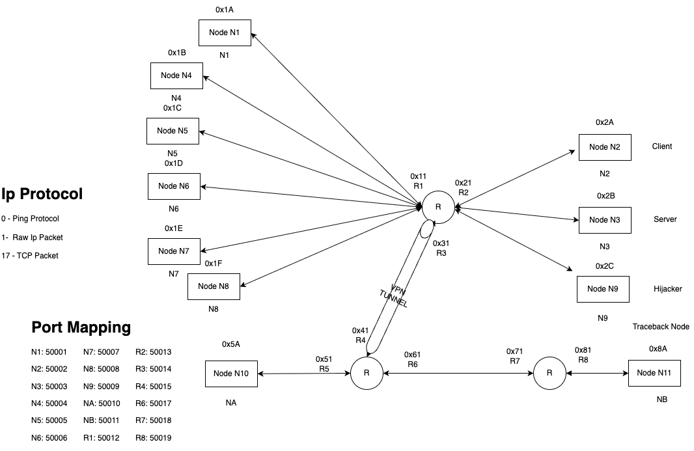

# 🧠 Networking Emulation Project (CS441)

## 📡 Network Topology

## 🛠️ Project Overview

This is a **network security project** where we implemented an emulated **IP-over-Ethernet network** from scratch using **socket programming** in Python.

The network consists of multiple nodes. All communication is built using low-level **UDP sockets** to emulate Ethernet behavior, including MAC addressing and IP-level routing.

### Core Objectives:
- 🔧 **Build the network stack from scratch**: including emulated Ethernet frames, IP packets, and protocol handlers.
- 📡 **Simulate realistic network behavior**: including broadcast, frame filtering, routing, and IP forwarding.
- 🛡️ **Implement security attacks**: such as IP spoofing, sniffing, TCP hijacking, and ICMP Smurf DDoS.
- 🔐 **Implement defense mechanisms**: including firewalls, IP traceback, and IPsec-style VPN tunnels.

This hands-on project required not only functional communication between devices, but also the design and demonstration of both offensive and defensive **network security techniques** — all layered over a user-built socket infrastructure.

## 🔌 Socket Programming Design
We used **UDP sockets** to simulate Ethernet-level communication between devices:

- Each node and router interface is represented as a **UDP socket** bound to a unique port.
- Ethernet broadcast behavior is emulated by sending frames to **a port** (UDP would demutiplex based on IP + Port).
- Each Ethernet frame includes:
  - 2-byte **Source MAC** (e.g., "N1")
  - 2-byte **Destination MAC** (e.g., "R1")
  - 1-byte **Data Length**
  - Up to 256 bytes of **Payload Data**

Each node’s socket listens on its assigned port and drops frames not intended for it (based on destination MAC address), simulating Ethernet behavior.

For Ethernet Frames, the frames would be broadcasted to all nodes in the same LAN.

## 🛡️ Security Features

### 🕵️ IP Spoofing 
Node1 is configured as a malicious actor. It forges the IP header by impersonating Node3 (`0x2B`) as the **source IP** in a ping packet targeting Node1 (`0x1A`). This tests the network’s ability to handle source address spoofing and demonstrates weaknesses in naive trust of source IP fields.

### 🔍 Sniffing Attack
Node3 is implemented as a malicious sniffer. It logs **all broadcasted Ethernet frames** on the shared medium and inspects payloads even if the destination MAC is not "N3". This mimics a passive sniffing attack in real Ethernet environments.

### 🔥 Firewall
Node3 includes a **user-configurable firewall** module. We try to mimic the functionality of ufw in linux which allows us to filter network packets based on pre-defined rules.
## 🌐 VPN Tunnel

We implemented a **VPN tunnel between two routers (0x31 and 0x41)** to emulate secure communication over an untrusted network.

### Features:
- **Key Exchange**: Utilizes the `cryptography` Python library with **Diffie-Hellman key exchange** to establish a shared session key.

- **Tunnel Modes**:
  - **ESP (Encapsulating Security Payload)**: Provides confidentiality and integrity with Encryption and HMAC.
  - **AH (Authentication Header)**: Provides only integrity and authentication with HMAC
- Encrypted payloads are tunneled between the two routers to simulate a real-world IPsec tunnel.
- Traffic routed through the tunnel is decrypted and verified at the receiving end.

## 💣 ICMP Smurf (DDoS Attack)

We implemented an **ICMP Smurf attack** as an example of a distributed denial-of-service (DDoS) attack within our emulated network.

### Attack Overview:
- **Smurf Node**: N4  
- **Victim Node**: N10

### Steps:
- N4 forges ICMP **echo requests** using **N10’s IP address** (0x5A) as the **spoofed source**.
- These requests are **broadcasted** to all nodes in the **R1 local area network** (LAN).
- Each node in the R1 LAN receives the echo request and responds with an **ICMP echo reply** back to N10.
- This causes **N10 to be flooded** with replies, overwhelming its buffer and simulating a **DDoS attack**.

### 🔍 IP Traceback

To identify the **true origin of the spoofed packets**, we implemented **Probabilistic Packet Marking** (a traceback mechanism):

- Each router in the path **randomly marks packets** by appends it's IP Address
- Marking occurs with a **configurable probability p**, such that not every packet is marked — with the IP Address
- The victim (N10) **collects multiple marked packets** and **reconstructs the path** based on the packet count of the different ip.
- Once enough packets are received, the victim can infer:
  - Which router interfaces the packets came through
  - The likely **source of the spoofed packets**, even if the IP source was forged

This probabilistic traceback technique helps **traceback the route to R1**, even when spoofed IPs are used to hide the source — showcasing a defensive method against amplification-based DDoS attacks.

# 🕵️ TCP Hijacking

We implemented a **TCP session hijacking attack**, demonstrating how a malicious node can intercept and take over a TCP connection between a client and server.

### Attack Scenario:
- **Real Client IP**: 0x2A (e.g., N2)
- **Server IP**: 0x2B
- **Attacker Node**: Spoofs ARP and IP to impersonate the client

### Steps:

#### Step 1: ARP Poisoning
The attacker sends a **spoofed ARP packet** to the server (0x2B), claiming that the attacker's MAC address is associated with 0x2A (the real client's IP address). This causes the server to send traffic to the attacker instead of the real client.

#### Step 2: Session Termination for the Real Client
The attacker **spoofs N3’s IP** and sends a **TCP RST (reset)** packet to the real client (N2) to terminate the existing TCP session. This prevents the real client from continuing communication.

#### Step 3: Impersonating the Client to the Server
The attacker now spoofs the **client’s IP (0x2A)** and uses the correct **TCP sequence and acknowledgment numbers** to continue the session with the server. The server believes it is still talking to the real client.

### Result:
The attacker successfully takes over the session and can **read**, **modify**, or **inject** data as if it were the legitimate client.

